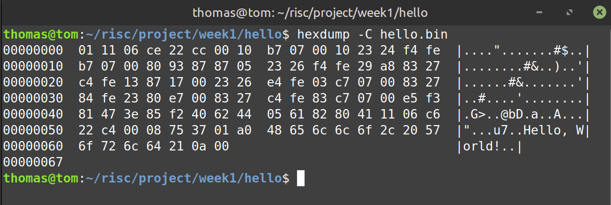

# 🚀 My Week 1 RISC-V SoC Lab Adventure

Welcome! This document is not just a log—it's my story of learning RISC-V bare-metal development from scratch. Every step below is written with beginners in mind, with practical code and my own notes. If you like hands-on, copy-paste-ready recipes and honest, personal tips, you’re in the right place! 🎉

---

## 1️⃣ Toolchain Setup & First Sanity Check 🛠️

**Goal:** Get the RISC-V GCC toolchain running on your machine.

**How I Did It:**

```bash
# Download the official toolchain
wget https://github.com/xpack-dev-tools/riscv-none-elf-gcc-xpack/releases/download/v14.2.0-3/xpack-riscv-none-elf-gcc-14.2.0-3-linux-x64.tar.gz

# Unpack it (creates a folder)
tar -xvzf xpack-riscv-none-elf-gcc-14.2.0-3-linux-x64.tar.gz

# Temporarily add to PATH for this session
export PATH=$PWD/xpack-riscv-none-elf-gcc-14.2.0-3/bin:$PATH

# Test if the tools are visible
riscv-none-elf-gcc --version
riscv-none-elf-objdump --version
riscv-none-elf-gdb --version
```

**My Output:**  


<br>

---

## 2️⃣ Hello, RISC-V World! (Minimal C) 👾

**Goal:** Build and inspect a minimal bare-metal "Hello World" that prints to UART.

**My Files:**
- `hello.c`
    ```c
    int main() {
        volatile char *uart = (char *)0x10000000;
        const char *msg = "Hello, World!\n";
        while (*msg) *uart = *msg++;
        return 0;
    }
    void _start() { main(); while (1); }
    ```
- `linker.ld`
    ```ld
    ENTRY(_start)
    SECTIONS {
        . = 0x80000000;
        .text : { *(.text*) }
        .data : { *(.data*) }
        .bss  : { *(.bss*) *(COMMON) }
    }
    ```

**How I Compiled:**
```bash
riscv-none-elf-gcc hello.c -o hello.elf \
-march=rv32imc -mabi=ilp32 -nostartfiles -nostdlib -T linker.ld
```
**Quick ELF Check:**
```bash
riscv-none-elf-objdump -d hello.elf
riscv-none-elf-readelf -h hello.elf | grep Entry
```

**My Output:**  


<br>

---

## 3️⃣ Assembly Unveiled: Function Prologue/Epilogue 🏗️

**Goal:** Generate and understand the assembly output.

**How I Did It:**
```bash
riscv-none-elf-gcc hello.c -S -o hello.s \
-march=rv32imc -mabi=ilp32 -nostartfiles -nostdlib -T linker.ld
```

**Prologue/Epilogue Example:**
```assembly
main:
    addi    sp,sp,-32    # Prologue: make stack space
    sw      ra,28(sp)    # Save return address
    ...
    lw      ra,28(sp)    # Epilogue: restore return address
    addi    sp,sp,32     # Clean up stack
    ret
```

**My Output:**  


<br>

---

## 4️⃣ ELF to Hex & Disassembly 🧩

**Goal:** See the raw machine code and what it means.

**How I Did It:**
```bash
# Convert ELF to raw binary
riscv-none-elf-objcopy -O binary hello.elf hello.bin

# Intel HEX format (for flashers)
riscv-none-elf-objcopy -O ihex hello.elf hello.hex

# Disassemble
riscv-none-elf-objdump -d hello.elf
riscv-none-elf-objdump -S hello.elf

# Show binary as hex dump
hexdump -C hello.bin
```

**My Output:**  





<br>

---

## 5️⃣ Quick-Glance: RISC-V Integer Registers Table 🧮

| Reg No | ABI Name | Purpose/Role              |
|--------|----------|--------------------------|
| x0     | zero     | Always 0                 |
| x1     | ra       | Return address           |
| x2     | sp       | Stack pointer            |
| x3     | gp       | Global pointer           |
| x4     | tp       | Thread pointer           |
| x5-x7  | t0-t2    | Temporary                |
| x8     | s0/fp    | Saved/Frame pointer      |
| x9     | s1       | Saved                    |
| x10-x17| a0-a7    | Args/return values       |
| x18-x27| s2-s11   | Callee-saved             |
| x28-x31| t3-t6    | Temporary                |

- **Caller-saved:** a0–a7, t0–t6  
- **Callee-saved:** s0–s11  
- **Special:** zero, ra, sp, fp

<br>

---

## 6️⃣ Debugging: GDB Magic 🐞

**Goal:** Step through code, see registers, and *really* learn.

```bash
riscv-none-elf-gcc -march=rv32im -mabi=ilp32 -nostdlib -T linker.ld -o hello2.elf hello2.c
riscv-none-elf-gdb hello2.elf
# Then in GDB:
# set breakpoint auto-hw off
# target sim
# load
# break main
# run
# step/stepi
# info registers
# print x
# continue
```

**My Output:**  


<br>

---

## 7️⃣ Booting in QEMU + UART Output 🎛️

**Goal:** Run my ELF in a virtual RISC-V and watch UART output.

```bash
riscv-none-elf-gcc -g -march=rv32im -mabi=ilp32 -nostdlib -T linker.ld -o hello2.elf hello2.c startup.s
qemu-system-riscv32 -nographic -machine virt -bios none -kernel ~/RISC/Projects/Week1/uart/hello2.elf
```

**Expected Output:**
```
Milen RISC-V Value
101
```

**My Output:**  


**Successful** We have got the desired output.
<br>

---

## 8️⃣ -O0 vs. -O2: Compiler Optimization Face-Off ⚡

**Goal:** See how optimization changes the generated code.

```bash
# No optimization
riscv-none-elf-gcc -g -O0 -march=rv32im -mabi=ilp32 -nostdlib -T linker.ld -o hello2_O0.elf hello2.c startup.s
# Optimized
riscv-none-elf-gcc -g -O2 -march=rv32im -mabi=ilp32 -nostdlib -T linker.ld -o hello2_O2.elf hello2.c startup.s
```

- `-O0`: Big stack frames, lots of memory access, easy for debugging.
- `-O2`: Tight, fast, uses lots of registers!

**My Output:**  


<br>

---

## 9️⃣ Reading the Cycle Counter ⏱️

**Goal:** Get the real-time cycle counter (hardware timer) using inline assembly.

```c
__asm__ volatile (
    "rdcycle %0"
    : "=r" (cycles)
    :
    :
);
```
- `"=r" (cycles)`: Output register.
- `volatile`: Don’t let the compiler optimize it away!

**My Output:**  


<br>

---

## 🔟 GPIO Toggle: Real Hardware Practice 💡

**Goal:** Toggle a GPIO register, and why `volatile` is a must.

```c
volatile unsigned int *GPIO_REGISTER = (volatile unsigned int *)0x10012000;
int main() {
    for (int i = 0; i < 10; ++i) {
        *GPIO_REGISTER = 1;
        *GPIO_REGISTER = 0;
    }
    return 0;
}
void _start() { main(); while(1); }
```

**My Output:**  


<br>

---

## 1️⃣1️⃣ Custom Linker Scripts: Own Your Memory Map 🗺️

**My `linker.ld` snippet:**
```ld
ENTRY(_start)
SECTIONS {
    .text 0x00000000 : { *(.text*) }
    .data 0x10000000 : { *(.data*) }
    .bss (NOLOAD) : { *(.bss*) *(COMMON) }
}
```

**How I Compiled:**
```bash
riscv-none-elf-gcc -march=rv32imc -mabi=ilp32 \
-nostdlib -nostartfiles -T link.ld \
_start.s hello.c -o hello.elf
```

**My Output:**  


<br>

---

## 1️⃣2️⃣ crt0.S: The Real Program Entry 🏁

Before `main()`, `crt0.S` sets up the stack, zeroes `.bss`, and more.  
**If `main()` is running, thank `crt0.S`!**

| Step | What It Does                                   |
|------|------------------------------------------------|
| 1    | Stack pointer setup                            |
| 2    | Zero `.bss`                                    |
| 3    | Copy `.data` to RAM (if needed)                |
| 4    | Calls `main()`                                 |
| 5    | Handles main return (often loops forever)      |

---

## 1️⃣3️⃣ Timer Interrupt: My First MTIP Handler ⏰

```bash
riscv-none-elf-gcc -g -O2 -march=rv32imc_zicsr -mabi=ilp32 -nostdlib -T linker.ld -o timer.elf timer_interrupt.c trap_handler.s startup.s
qemu-system-riscv32 -nographic -machine virt -bios none -kernel timer.elf
```

**My Output:**  


<br>

---

## 1️⃣4️⃣ The 'A' (Atomic) Extension: Why Multicore Matters 🔒

- **Atomic instructions** (`lr.w`, `sc.w`, `amoadd.w`, etc.) let me write safe, lock-free code for multi-core systems.
- **Why care?** Needed for mutexes, semaphores, and real-world concurrency!

---

## 1️⃣5️⃣ Two-Thread Mutex with LR/SC: DIY Multithreading 🤝

```bash
riscv-none-elf-gcc -g -O2 -march=rv32imac_zicsr -mabi=ilp32 -nostdlib -T linker.ld -o mutex.elf mutex_example.c startup.s
qemu-system-riscv32 -nographic -machine virt -bios none -kernel mutex.elf
```

**My Output:**  


<br>

---

## 1️⃣6️⃣ printf to UART: My Custom _write 🖨️

```c
#include <stdint.h>
#include <unistd.h>
volatile uint32_t *const UART_DR = (volatile uint32_t *)0x10000000;
volatile uint32_t *const UART_SR = (volatile uint32_t *)0x10000005;
#define UART_SR_TX_READY (1 << 5)

ssize_t _write(int file, const void *ptr, size_t len) {
    if (file == STDOUT_FILENO || file == STDERR_FILENO) {
        const char *buf = (const char *)ptr;
        for (size_t i = 0; i < len; ++i) {
            while (!(*UART_SR & UART_SR_TX_READY));
            *UART_DR = buf[i];
        }
        return len;
    }
    return -1;
}
```

> **TIP:** You may also need `_read` and `_sbrk` for a fully working C library.

---

## 1️⃣7️⃣ Endianness Detective: My Union Trick 🔄

```c
union {
    uint32_t value;
    uint8_t bytes[4];
} endian_test;

endian_test.value = 0x01020304;

for (int i = 0; i < 4; i++)
    printf("Byte %d: 0x%02x\n", i, endian_test.bytes[i]);

if (endian_test.bytes[0] == 0x04)
    printf("Little-Endian\n");
else
    printf("Big-Endian\n");
```
**Expected Output:**
```
Byte order:
Byte 0: 0x04
Byte 1: 0x03
Byte 2: 0x02
Byte 3: 0x01
Little-Endian
```

**My Output:**  


<br>

---

# 🌟 This is all for Week 1! 
Thank You
